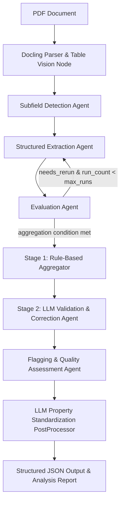

# KnowMat Framework Evaluation Report: Polymer Diffusion Coefficient Extraction

## Executive Summary

**KnowMat** (implemented in `knowmat`/`KnowMat2`) is an agentic, multi-pass materials science knowledge extraction framework published in *Integrating Materials and Manufacturing Innovation* (2026). It employs a **LangGraph-driven multi-agent architecture** combining Docling PDF parsing, LLM-based vision table parsing, subfield prompt adaptation, iterative extraction and evaluation loops, two-stage aggregation/validation, and automated quality flagging.

While **KnowMat excels at high-fidelity structured extraction for conventional materials science** (such as metallic alloys, ceramics, and inorganic compounds), **out-of-the-box it has key limitations for extracting polymer diffusion coefficient data** (specifically fitting coefficient $c$ and Flory exponent $v$ in $D = c M^v$). 

This report provides a deep technical breakdown of how KnowMat works, lists its general strengths and weaknesses, and evaluates its effectiveness for extracting structured polymer diffusion parameters, alongside actionable recommendations for adaptation.

---

## 1. System Architecture & How KnowMat Works

KnowMat coordinates seven core stages managed via a LangGraph state machine (`build_graph()` in [`orchestrator.py`](file:///c:/Users/henry/Github/KnowMat2/src/knowmat/orchestrator.py)):



### Stage-by-Stage Workflow

1. **Docling PDF Parsing & Vision Table Extraction ([`docling_parse_pdf.py`](file:///c:/Users/henry/Github/KnowMat2/src/knowmat/nodes/docling_parse_pdf.py))**:
   - Uses **Docling** to parse PDF layout and extract table bounding boxes into PNG images.
   - Invokes OpenAI Vision models (`gpt-4o`/`gpt-5`) to convert table images into clean, semantically rich HTML tables (preserving merged cells and complex headers), replacing raw table placeholders in the document Markdown.

2. **Subfield Detection ([`subfield_detection.py`](file:///c:/Users/henry/Github/KnowMat2/src/knowmat/nodes/subfield_detection.py))**:
   - Classifies the paper into *experimental*, *computational*, *simulation*, *machine learning*, or *hybrid* subfields.
   - Prepends domain-tailored instructions to the main extraction system prompt.

3. **Structured Extraction ([`extraction.py`](file:///c:/Users/henry/Github/KnowMat2/src/knowmat/nodes/extraction.py) & [`prompt_generator.py`](file:///c:/Users/henry/Github/KnowMat2/src/knowmat/prompt_generator.py))**:
   - Utilizes `TrustCall` with Pydantic schemas ([`CompositionList`](file:///c:/Users/henry/Github/KnowMat2/src/knowmat/extractors.py#L248-L254), [`CompositionProperties`](file:///c:/Users/henry/Github/KnowMat2/src/knowmat/extractors.py#L228-L246), [`Property`](file:///c:/Users/henry/Github/KnowMat2/src/knowmat/extractors.py#L148-L226)) to extract compositions, processing conditions, characterization techniques, and measurable material properties.

4. **Iterative Evaluation Loop ([`evaluation.py`](file:///c:/Users/henry/Github/KnowMat2/src/knowmat/nodes/evaluation.py))**:
   - Evaluates extracted JSON against full paper text, outputting confidence scores, rationale, `missing_fields`, `hallucinated_fields`, and prompt updates. Loops up to `max_runs` times (default: 3).

5. **Two-Stage Aggregation & Validation**:
   - **Stage 1 ([`aggregator.py`](file:///c:/Users/henry/Github/KnowMat2/src/knowmat/nodes/aggregator.py))**: Rule-based, deterministic merging across passes (selects highest-confidence base run, merges new compositions/properties, resolves text length conflicts without LLM overhead).
   - **Stage 2 ([`validator.py`](file:///c:/Users/henry/Github/KnowMat2/src/knowmat/nodes/validator.py))**: LLM-driven hallucination detection and correction (restores lost string inequalities, clears improper zero placeholders, validates ML-ready property triplets).

6. **Flagging & Human Guidance ([`flagging.py`](file:///c:/Users/henry/Github/KnowMat2/src/knowmat/nodes/flagging.py))**:
   - Computes weighted final confidence (40% manager fixes, 30% completeness, 20% run consistency, 10% residual uncertainty) and creates a tailored `human_review_guide`.

7. **Property Standardization PostProcessor ([`post_processing.py`](file:///c:/Users/henry/Github/KnowMat2/src/knowmat/post_processing.py))**:
   - Maps extracted property names/symbols to a canonical taxonomy in [`properties.json`](file:///c:/Users/henry/Github/KnowMat2/src/knowmat/properties.json) using `gpt-5-mini`.

---

## 2. General Strengths & Weaknesses of KnowMat

### Key Strengths

| Feature | Description | Benefit |
| :--- | :--- | :--- |
| **Agentic Iterative Refinement** | Multi-pass extraction-evaluation loop with dynamic prompt patching | Significantly reduces false negatives and recovers properties missed in single-pass LLM prompts |
| **High-Fidelity Table Processing** | Vision-based table-to-HTML conversion via Docling + GPT Vision | Accurately extracts complex scientific tables with multi-span headers and footnotes |
| **Dual-Representation Property Schema** | Captures raw text `value` (e.g. `">50"`, `"12-30"`) alongside `value_numeric` and `value_type` | Preserves physical bounds and inequality constraints while maintaining ML-ready numerical numeric fields |
| **Two-Stage Manager Design** | Separates deterministic merging (Stage 1) from LLM hallucination correction (Stage 2) | Eliminates token waste during merging while preserving deep LLM verification |
| **Actionable Quality Assurance** | Automated scoring, flagging (`confidence < 0.8`), and detailed human review guides | Streamlines human-in-the-loop curation by pinpointing exact entries requiring verification |

### Key Weaknesses & Limitations

| Limitation | Impact | Root Cause |
| :--- | :--- | :--- |
| **High Token Cost & Latency** | Processing a single paper can take 2–5 minutes and multiple OpenAI API calls | Multiple extraction/evaluation loops, vision table parsing, manager, flagging, and post-processing LLMs |
| **Rigid Composition-Centric Schema** | All data must be nested under discrete chemical `compositions` (e.g. stoichiometry formulas) | Model designed primarily for inorganic compounds/alloys rather than complex polymer networks or solutions |
| **Naive Reference Stripping** | Regex truncates everything after `# References` header | Can accidentally strip supplementary sections, appendix tables, or end-of-paper data tables |
| **Proprietary LLM Hardcoding** | Built specifically around OpenAI models (`gpt-5`, `gpt-4o`) and custom `responses` API calls | Cannot easily run offline or switch to open-weight models (e.g. Llama-3, Qwen) without code modification |
| **Property Taxonomy Gaps** | Built-in [`properties.json`](file:///c:/Users/henry/Github/KnowMat2/src/knowmat/properties.json) lacks transport/polymer parameters | Fails to recognize polymer-specific scaling laws or diffusion parameters without taxonomy updates |

---

## 3. Evaluation for Polymer Diffusion Coefficient ($c$ and $v$) Extraction

The specific goal is to extract **structured diffusion coefficient data for polymers**, namely:
- Fitting coefficient $c$ (pre-factor in scaling relations like $D = c M^v$ or $D = c M^{-b}$)
- Flory parameter / scaling exponent $v$ (or $\nu$, describing chain conformation and solvent quality)
- Exclusively for polymer systems.

### Suitability Rating: 🟡 **Moderate Out-of-the-Box / High Potential with Modifications**

While KnowMat's core parsing engine and iterative evaluation loop provide a strong foundation, several domain-specific gaps hinder out-of-the-box extraction of $c$ and $v$:

```
                       Polymer Diffusion Extraction Challenges
┌────────────────────────────────────────────────────────────────────────────────────┐
│ 1. Schema Misalignment                                                             │
│    - Polymer systems require: Polymer Name, Solvent, Mw, Concentration, Temp, c, v │
│    - KnowMat schema requires: Composition (Alloy/Formula), Property (Name, Val, Unit)│
├────────────────────────────────────────────────────────────────────────────────────┤
│ 2. Symbol Ambiguity                                                                │
│    - 'c' in KnowMat prompt examples → Concentration / Lattice parameter 'c'        │
│    - 'v' in KnowMat prompt examples → Poisson's ratio / Volume / Kinematic viscosity│
├────────────────────────────────────────────────────────────────────────────────────┤
│ 3. Missing Property Taxonomy                                                       │
│    - properties.json has 0 entries for diffusion coefficients, c, or Flory exponent v│
├────────────────────────────────────────────────────────────────────────────────────┤
│ 4. Fitting Function vs Single-Point Measurement                                    │
│    - c and v are scaling function parameters (D = c * M^v), not single point Tg/Tm │
└────────────────────────────────────────────────────────────────────────────────────┘
```

### Detailed Analysis of Domain Gaps

#### 1. Missing Taxonomy in `properties.json`
In [`properties.json`](file:///c:/Users/henry/Github/KnowMat2/src/knowmat/properties.json), standard properties are categorized into 7 domains: *optical*, *phase transitions*, *electronic/electrical*, *superconductivity*, *magnetic*, *mechanical*, and *thermal/thermodynamic*. 
- **There are zero entries for mass transport, diffusion coefficients, pre-factors ($c$), or Flory exponents ($v$).**
- As a result, KnowMat's [`PostProcessor`](file:///c:/Users/henry/Github/KnowMat2/src/knowmat/post_processing.py#L87-L178) will fail to match or standardize extracted diffusion parameters, returning `null` for standard property names.

#### 2. Symbol & Property Name Ambiguity ($c$ and $v$)
- In general materials science prompts (like [`prompt_generator.py`](file:///c:/Users/henry/Github/KnowMat2/src/knowmat/prompt_generator.py#L116-L150)), symbols like $c$ or $v$ are ambiguous:
  - $c$ typically gets mapped to *lattice parameter $c$*, *concentration*, or *speed of light*.
  - $v$ (or $\nu$) gets mapped to *Poisson's ratio*, *volume*, *kinematic viscosity*, or *velocity*.
- Without domain-specific prompt engineering explicitly defining $D = c M^v$ (where $c$ is the diffusion coefficient pre-factor and $v$ is the Flory/scaling exponent), general LLMs frequently misinterpret $c$ and $v$.

#### 3. Composition-Centric Schema vs. Polymer Characterization
In KnowMat's [`CompositionProperties`](file:///c:/Users/henry/Github/KnowMat2/src/knowmat/extractors.py#L228-L246) schema:
- Every property must belong to a single `composition` string (e.g. `"Zr64Cu16Ni10Al10"`).
- In polymer diffusion research, measurements depend on a multi-variable context:
  - **Polymer identity** (e.g., *Polystyrene*, *PEG*, *PDMS*)
  - **Solvent / Medium** (e.g., *Toluene*, *THF*, *Water*, *Melt*)
  - **Molecular Weight ($M_w$ or $M_n$) & Polydispersity (PDI)**
  - **Temperature ($T$) & Solution Concentration ($C$)**
  - **Diffusion Fitting Model** ($D = c M^v$ or $D = D_0 \exp(-E_a / RT)$)
- Forcing solvent, molecular weight, and fitting context into KnowMat's unstructured `measurement_condition` field causes loss of structured database querying capability.

#### 4. Model Scaling Parameters vs. Direct Point Measurements
- Direct properties (like glass transition temperature $T_g = 373\text{ K}$) are simple scalar point values.
- Polymer diffusion parameters $c$ and $v$ are **fitted model parameters** obtained by regression over a series of molecular weights $M$:
  $$\ln D = \ln c + v \ln M$$
- KnowMat's `Property` model lacks fields to record the regression range (e.g. $M_w \in [10^3, 10^6] \text{ g/mol}$), goodness of fit ($R^2$), or fit model type.

---

## 4. Recommendations for Adapting KnowMat for Polymer Diffusion Data

To make KnowMat highly effective for extracting polymer diffusion coefficients ($c$ and $v$), apply the following modifications:

### Step 1: Extend `properties.json` Taxonomy
Add a dedicated `"transport properties"` domain to [`src/knowmat/properties.json`](file:///c:/Users/henry/Github/KnowMat2/src/knowmat/properties.json):
```json
"transport properties": {
    "diffusion coefficient": [
        "diffusion coefficient", "self-diffusion coefficient", "mutual diffusion coefficient", "tracer diffusion coefficient"
    ],
    "diffusion pre-factor": [
        "diffusion coefficient pre-factor", "diffusion pre-factor", "c", "D0", "diffusion constant prefactor"
    ],
    "flory exponent": [
        "flory exponent", "flory parameter", "scaling exponent v", "scaling exponent nu", "v", "nu", "diffusion scaling exponent"
    ]
}
```

### Step 2: Inject Polymer Diffusion Rules into Prompt Generator
Update [`src/knowmat/prompt_generator.py`](file:///c:/Users/henry/Github/KnowMat2/src/knowmat/prompt_generator.py) with explicit polymer diffusion extraction instructions:
- Define the scaling law: $D = c M^v$ (or $D = c M^{-b}$).
- Explicitly instruct the LLM to extract:
  - `property_name`: `"diffusion pre-factor"` ($\text{symbol: } c$)
  - `property_name`: `"flory exponent"` ($\text{symbol: } v$ or $\nu$)
- Require `measurement_condition` to capture: Polymer name, Solvent, Molecular weight range ($M_w$), Temperature ($T$), and Solution concentration ($C$).

### Step 3: Enhance the Pydantic Property Schema (Optional but Recommended)
Extend [`Property`](file:///c:/Users/henry/Github/KnowMat2/src/knowmat/extractors.py#L148-L226) or create a specialized `PolymerDiffusionProperty` schema to include:
- `solvent`: Optional[str]
- `molecular_weight_range`: Optional[str]
- `temperature`: Optional[str]
- `fit_equation`: Optional[str] (e.g. `"D = c * M^v"`)

---

## 5. Conclusion

KnowMat is a state-of-the-art multi-agent framework with excellent PDF/table parsing and iterative self-correction capabilities. 

To use it effectively for **polymer diffusion coefficients ($c$ and $v$)**, the pipeline should be customized by extending `properties.json` with transport properties, injecting domain-specific polymer diffusion prompt guidance, and linking polymer-solvent-molecular weight metadata to the extracted parameters.
