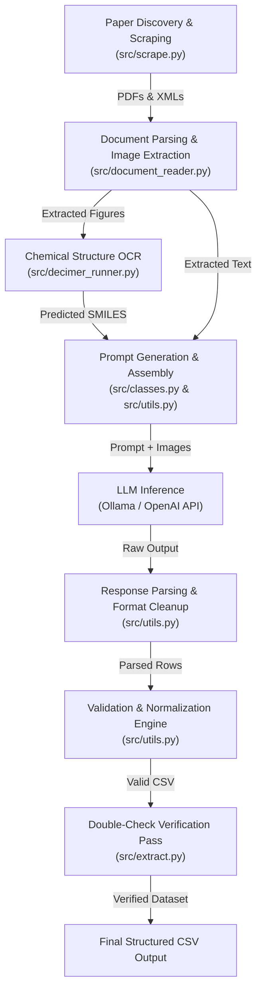

# LoA (Librarian of Alexandria) Technical Architecture & Capability Evaluation Report

## 1. Executive Summary

**Librarian of Alexandria (LoA)** is an end-to-end Python framework designed to automate the searching, downloading, parsing, and LLM-driven structured data extraction from scientific literature. It integrates multi-source paper scraping (PubMed Central, arXiv, ScienceOpen, Unpaywall, custom databases), document text/image parsing, DECIMER chemical OCR for figure structure extraction, schema-driven LLM prompting (supporting local Ollama models and OpenAI APIs), domain-specific chemistry/biology validation, and row-level double-check verification.

This report evaluates the core architecture of LoA, details its general strengths and weaknesses, and provides a focused assessment of its capability to construct a structured dataset of **chemical diffusion coefficients ($c$) and Flory parameters ($\nu$/$v$)** for fitted polymer diffusion curves from chemical literature PDFs.

---

## 2. Technical Architecture & Component Breakdown

The LoA repository is structured into distinct, modular subsystems:



### Key Modules
1. **Scraping Subsystem (`src/scrape.py`)**:
   - Queries PubMed Central (Entrez API), arXiv, ScienceOpen, Unpaywall, or custom databases using configurable search term sets (`def_search_terms`, `maybe_search_terms`).
   - Downloads full-text PDFs and XML files into `scraped_docs/`.
   - Supports local ingestion mode (bypassing search to process existing local PDFs).

2. **Document Ingestion & Image Extraction (`src/document_reader.py`)**:
   - Converts PDFs to text using `pdf2txt.py` (HTML mode), extracting raw text and embedded figure images.
   - Parses XML files for PubMed Central articles and fetches open-access figure archives (`.tar.gz`).
   - Filters images using a pixel dimension threshold ($<150\text{ px}$ discarded).

3. **Chemical Figure OCR (`src/decimer_runner.py` / `src/decimer_segment_runner.py`)**:
   - Uses Mask R-CNN image segmentation to locate chemical structure diagrams in figure images.
   - Runs DECIMER deep learning models to translate 2D chemical structure diagrams into canonical SMILES strings.
   - Contextually inserts predicted SMILES back into the paper text at figure location tags `[image_name.png]`.

4. **Schema & Prompting Framework (`src/meta_model.py`, `src/classes.py`)**:
   - Manages interactive and batch extraction schemas saved as `.pkl` objects.
   - Injects pre-defined target columns based on `target_type`:
     - `small_molecule` (SMILES)
     - `protein` / `peptide` (Amino Acid Sequence)
     - `polymer` (BigSMILES)
     - `reaction` (Reactants & Products)
     - `general` (User-defined columns without automatic target injection)
   - Generates few-shot prompts with strict column, type, and example rules.

5. **Validation & Normalization Engine (`src/utils.py`)**:
   - Validates LLM responses against schema rules (`str`, `int`, `float`, `range`, `allowed_values`, `min/max`).
   - Applies chemical entity normalization via RDKit, PubChemPy, Cirpy, UniProt, RCSB PDB, and a lightweight BigSMILES syntax check.
   - Enforces key column deduplication and handles built-in solvent mapping (including automatic water SMILES fallback).

6. **Verification & Audit (`src/extract.py` -> `batch_double_check`)**:
   - Runs a secondary row-verification pass where the LLM is re-prompted with candidate rows and original paper text to verify existence (`yes`/`no`).

---

## 3. General Strengths and Weaknesses of LoA

### Strengths

1. **End-to-End Literature Pipeline**: Unified workflow from paper discovery and PDF scraping to figure OCR, LLM extraction, validation, and verification.
2. **Decimer Chemical OCR Integration**: Unique and powerful capability to extract chemical structure representations (SMILES) directly from embedded figures and insert them contextually into document text.
3. **Robust Entity Normalization**: Integrates authoritative chemical databases (PubChem, RDKit, Cirpy) and biological databases (UniProt, PDB) to resolve chemical names/trade names to canonical representations.
4. **Flexible Local vs. Cloud LLM Backends**: Native support for local Ollama deployments (enabling privacy and zero API cost) alongside OpenAI vision models.
5. **Row-Level Verification Pass**: The `double_check` system acts as a strong safeguard against hallucinated data rows by verifying candidates against source text.
6. **Customizable Schema Generator**: Flexible schema builder (`UI_schema_creator`) allows users to define custom extractions with type constraints and per-column validation modes.

### Weaknesses

1. **Fragile Text Extraction (`pdf2txt.py`)**:
   - Relies on basic HTML text extraction from `pdfminer.six`.
   - Strips spatial layout, causing complex tables, multi-column text, sub/superscripts ($c_0$, $M_w$), and mathematical equations to become garbled or flattened strings.
2. **Text-Centric / Flat CSV Paradigm**:
   - Output model is strictly flat tabular CSV. Struggle to represent hierarchical data (e.g., a single polymer paper with multiple fitting models, temperatures, solvents, and series of $(c, \nu)$ curves).
3. **Rigid Image Filtering Threshold**:
   - Automatically deletes images $<150\text{ px}$. This often discards small plot legends, inline equation figures, or small chemical structure callouts.
4. **Lightweight Polymer Validation**:
   - Polymer validation (`_bigsmiles_from_string`) relies only on basic heuristic regex checks for balanced brackets and `{}` braces rather than true chemical graph parsing, allowing syntactically invalid BigSMILES or misclassified polymer names through.
5. **Lack of Unit & Mathematical Awareness**:
   - Does not parse or normalize physical units (e.g., $\text{cm}^2/\text{s}$ vs $\text{m}^2/\text{s}$, exponents $10^{-7}$).
   - No built-in handling for mathematical symbols ($\nu$, $\mu$, $\chi$, $\gamma$), which are frequently mangled during PDF text extraction.
6. **No Plot/Curve Digitization**:
   - DECIMER processes chemical structures, not quantitative data plots. If diffusion curves or parameters ($c, \nu$) are presented only in figures/plots (x-y graphs) rather than explicit tables or text, LoA cannot extract data points from the plot axes.

---

## 4. Specific Evaluation: Extracting Polymer Diffusion Coefficients ($c$) and Flory Parameters ($\nu$/$v$)

### Goal Definition
Extracting fitted polymer diffusion parameters from chemical literature PDFs:
- **Polymer Identity**: Name, structure, or BigSMILES notation.
- **Diffusion Coefficient ($c$ or $D$)**: Pre-exponential factor / fitted coefficient $c$ in scaling laws such as $D = c \cdot M^{-\nu}$ or concentration-dependent diffusion $D(c) = D_0 \exp(\gamma c)$.
- **Flory Parameter ($\nu$ / $v$)**: Scaling exponent $\nu$ (good solvent $\approx 0.588$, theta solvent $= 0.5$, bad solvent $= 0.33$) or Flory-Huggins interaction parameter $\chi$.
- **Experimental Conditions**: Temperature ($T$), Solvent, Polymer Molecular Weight ($M_w$), Measurement Method (NMR, FRAP, QELS, Gravimetric).

---

### Detailed Assessment Matrix for Polymer Diffusion Parameter Extraction

| Feature / Requirement | LoA Capability Assessment | Verdict |
| :--- | :--- | :---: |
| **Polymer Entity Recognition** | In `polymer` target mode, LoA expects BigSMILES strings. Literature papers rarely write BigSMILES; they use trade names (e.g., PS, P3HT, PEG). LoA's BigSMILES validator will reject polymer names unless run under `target_type: "general"`. | **Conditional Pass** (Use `general` mode) |
| **Extracting $c$ and $\nu$ from Narrative Text** | If $c$ and $\nu$ are explicitly stated in text (e.g., *"the scaling exponent v was fitted as 0.58"*), LLM prompting in LoA extracts them easily. | **High Capability** |
| **Extracting $c$ and $\nu$ from Tables** | `pdf2txt.py` flattens PDF tables. Column alignment and mathematical headers (e.g., $c \times 10^{8}$) are frequently lost or garbled. | **Medium / High Failure Risk** |
| **Extracting $c$ and $\nu$ from Plot Figures** | DECIMER only transcribes chemical structure diagrams. Vision LLMs via multimodal input can view whole figure images, but lack curve digitization tools to reliably read plot axes/fitting lines. | **Low Capability** |
| **Mathematical Symbol Extraction** | Standard PDF-to-text conversion often converts Greek letters ($\nu$) or subscripts ($c_0$) to whitespace, `v`, `n`, or noise characters. | **Medium Risk** |
| **Unit & Exponent Normalization** | Schema handles `float` types and `min_value`/`max_value` validation, but lacks automated unit conversion. $c = 3.2 \times 10^{-7}$ may be extracted as `3.2` if instructions aren't meticulously tuned. | **Requires Strict Prompting** |
| **Hallucination Prevention** | The `double_check` module verifies extracted $(c, \nu)$ parameters directly against source paper text, drastically reducing false extractions. | **Major Strength** |

---

## 5. Recommendations for Implementing the Extraction Pipeline in LoA

To successfully extract polymer diffusion parameters ($c$ and $\nu$) using LoA, implement the following configuration and customization strategy:

### 1. Schema Design Configuration
- **Use `target_type: "general"`**: Avoid automatic BigSMILES target injection, as polymer literature predominantly uses IUPAC names, abbreviations, or structural repeat unit descriptions.
- **Explicit Schema Fields**:
  ```yaml
  1 - polymer_name (str, required)
  2 - polymer_smiles_or_bigsmiles (str, optional, validation_mode: polymer)
  3 - diffusion_coefficient_c_value (float, min: 0.0, max: 1e5)
  4 - diffusion_coefficient_c_exponent (int, e.g. -7, -8, -11)
  5 - diffusion_coefficient_units (str, allowed: [cm2/s, m2/s, mm2/s])
  6 - flory_exponent_v (float, min: 0.2, max: 1.2)
  7 - flory_parameter_type (str, allowed: [scaling_exponent_v, flory_huggins_chi])
  8 - solvent (str, validation_mode: small_molecule)
  9 - temperature_k (float, min: 100.0, max: 600.0)
  10 - measurement_method (str)
  ```

### 2. PDF Parsing Upgrade Recommendation
- Replace or supplement `pdf2txt.py` in `document_reader.py` with a layout-aware PDF table engine (such as `pdfplumber`, `Marker`, or `Docling`) to preserve mathematical table structures and exponent headers before sending text to the LLM.

### 3. Prompting & Exponent Safeguards
- In `user_instructions`, explicitly instruct the LLM on handling scientific notation and Greek symbol variations:
  > *"Extract the chemical diffusion coefficient pre-factor 'c' and the Flory scaling exponent 'v' (also written as nu, ν, or scaling exponent). Ensure the scientific notation exponent (e.g. 10^-7) is captured in a separate column. If parameters are given as D = c * M^(-v), record c and v separately."*

### 4. Mandatory Double-Check Verification
- Always enable `"double_check"` in your job JSON script. This re-verifies extracted numerical values against original paper context to guarantee zero hallucinated parameter values.

---

## 6. Summary Conclusion

**LoA is a solid, extensible framework** for chemical literature mining. Its primary strengths lie in its automated multi-source scraping, DECIMER chemical OCR integration, RDKit/PubChem validation, and automated double-check verification. 

For the task of extracting **fitted polymer diffusion parameters ($c$ and $\nu$)**:
- **It succeeds well** when papers present parameters in narrative text or clean tables, provided the schema uses `target_type: "general"` and strict prompt engineering for scientific notation.
- **It struggles** when data is embedded in garbled PDF tables (due to basic `pdf2txt.py` text extraction) or when parameters are represented solely as graphical curve plots in figures (since DECIMER targets molecular structure diagrams, not plot digitizing).
- Implementing a layout-aware table parser upgrade in `document_reader.py` will make LoA an outstanding pipeline for this domain.
