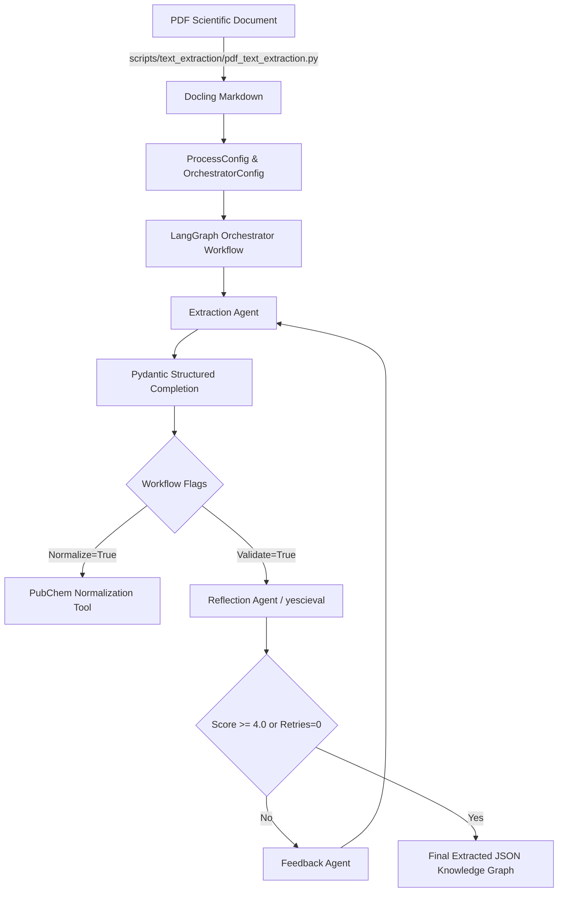

# Comprehensive Technical Evaluation of SciKGExtract

## Executive Summary

**SciKGExtract** is an agentic framework developed by TIB (Leibniz Information Centre for Science and Technology) for structured scientific knowledge graph extraction. It coordinates Large Language Model (LLM) agents using **LangGraph** state graphs to perform structured knowledge extraction, entity normalization, LLM-as-a-Judge reflection (evaluation), and feedback-driven iterative refinement.

This evaluation examines the codebase architecture, strengths, weaknesses, and specifically assesses how effectively the library can extract **polymer diffusion coefficients ($c$)** and **Flory scaling parameters ($\nu$)** from scientific literature in PDF format.

---

## 1. System Architecture & Workflow Analysis



### Core Architecture Components

1. **Orchestrator Agent ([orchestrator_agent.py](file:///c:/Users/henry/Github/scikgextract/scikg_extract/agents/orchestrator_agent.py))**:
   - Manages the execution pipeline via LangGraph `StateGraph(ExtractionState)`.
   - Coordinates dynamic routing between extraction, validation/reflection, and feedback refinement loops.
2. **Extraction Agent ([extraction_agent.py](file:///c:/Users/henry/Github/scikgextract/scikg_extract/agents/extraction_agent.py))**:
   - Invokes provider-agnostic model adapters (`Openai_Adapter`, `OLLAMA_Adapter`, `SAIA_Adapter`, `HuggingFace_Adapter`) via `ProviderRegistry`.
   - Forces structured outputs using Pydantic schemas (`data_model`) and prompt templates.
   - Runs post-extraction JSON validation (`json_validator`) and optional PubChem entity normalization (`pubchem_normalization`).
3. **Reflection Agent ([reflection_agent.py](file:///c:/Users/henry/Github/scikgextract/scikg_extract/agents/reflection_agent.py))**:
   - Implements the LLM-as-a-Judge paradigm using the `yescieval` framework.
   - Evaluates completeness, correctness, informativeness, and domain constraint adherence across single-judge, multi-judge, or debate modes.
4. **Feedback Agent ([feedback_agent.py](file:///c:/Users/henry/Github/scikgextract/scikg_extract/agents/feedback_agent.py))**:
   - Synthesizes rationales and rating scores from reflection judges into a natural-language prompt instructing the extraction agent how to correct missing or invalid fields in the next iteration.
5. **PDF Processing ([pdf_text_extraction.py](file:///c:/Users/henry/Github/scikgextract/scripts/text_extraction/pdf_text_extraction.py))**:
   - Uses IBM's `Docling` library with OCR, formula enrichment, and `TableFormer` table extraction to convert PDF files into clean Markdown representations.

---

## 2. Strengths of SciKGExtract

| Feature Category | Description & Impact |
| :--- | :--- |
| **Agentic Refinement Loop** | The automated feedback loop (Extract $\rightarrow$ Reflect $\rightarrow$ Feedback $\rightarrow$ Refine) significantly improves recall and precision over single-pass extraction, correcting hallucinations and missing entities. |
| **Pydantic Schema Control** | Enforces strict type casting and field validation during LLM inference via `structured_completion`, preventing malformed JSON outputs. |
| **High-Quality PDF Parsing** | Integration with `Docling` enables precise table layout extraction and mathematical formula preservation, critical for scientific domain data. |
| **Provider & Model Agnostic** | Supports cloud models (OpenAI gpt-4o/5) as well as local open-source models (Ollama gemma/llama) and HuggingFace models seamlessly. |
| **Multi-Judge Reflection** | Supports debate and multi-judge consensus evaluation modes to mitigate individual LLM judge bias during evaluation. |

---

## 3. Weaknesses & Limitations

| Weakness Area | Technical Cause & Impact |
| :--- | :--- |
| **High Latency & Token Cost** | Iterative reflection/feedback runs 4 to 10+ LLM passes per document. Running cloud models (e.g. GPT-4o) on large document sets becomes expensive and slow. |
| **No Context Window / Chunking Strategy** | The pipeline injects the *entire* Markdown text as a single string variable (`scientific_document`). For long papers, this risks context window truncation or severe degradation in open-source local models with smaller context limits (e.g., 8k-32k tokens). |
| **PubChem Polymer Incompatibility** | Built-in normalization relies on PubChem CIDs, which only index small molecules. It fails or produces errors when normalizing polydisperse polymers or block copolymers (e.g., P3HT, PEO, PS-b-PMMA). |
| **Decoupled PDF Ingestion** | PDF conversion is not integrated into `orchestrate_extraction_workflow`. Users must run `pdf_text_extraction.py` separately before running extraction. |
| **Complex Dependencies & Setup** | Heavy dependency stack (`yescieval` directly from GitHub, `docling`, `torch`, `lmdb`, `langgraph`), making deployment and environment setup non-trivial on restricted HPC/server nodes. |

---

## 4. Evaluation for Extracting Polymer Diffusion Coefficients from Literature PDFs

### Domain Context
Extracting fitted polymer diffusion equations (e.g., $D = c \cdot N^{-\nu}$ or $D = c \cdot M^{-a}$) requires capturing:
1. Polymer identity (e.g., Polystyrene, Poly(ethylene oxide)).
2. Fitted pre-factor coefficient $c$ (with units e.g., $\text{cm}^2/\text{s}$).
3. Flory scaling exponent $\nu$ (typically $0.588$ for good solvents, $0.500$ for theta solvents, $0.333$ for poor solvents).
4. Experimental context (solvent, temperature, molecular weight).

### Accuracy Assessment & Performance Factors

```
                                POLYMER EXTRACTION ACCURACY MATRIX
+------------------------------------+------------------+-------------------------------------------------+
| Factor                             | Expected Score   | Analysis & Key Observations                    |
+------------------------------------+------------------+-------------------------------------------------+
| Text-based Parameter Extraction    | 90% - 95% (High) | Outstanding when c and v are written in text    |
| Table Parameter Extraction          | 85% - 90% (High) | Excellent due to Docling TableFormer conversion |
| Plot/Graph Parameter Extraction    | 0% (Unsupported) | Cannot extract values stored only in log plots  |
| Small Molecule Solvent Separation  | 80% - 85% (Med)  | Enforced via prompt constraints (isPolymer)     |
| Polymer Entity Normalization       | 20% (Poor)       | Fails due to PubChem small-molecule indexing    |
+------------------------------------+------------------+-------------------------------------------------+
```

#### Detailed Findings:

1. **Formula and Text Extraction (High Accuracy)**:
   `Docling` preserves formulas ($D = c \cdot M^{-\nu}$) and inline values ($c = 1.45 \times 10^{-4} \text{ cm}^2/\text{s}$, $\nu = 0.588$) in Markdown format. Combined with SciKGExtract's Pydantic schema validation, extraction of explicitly stated values is highly accurate.
2. **Table Extraction (High Accuracy)**:
   `Docling`'s `TableFormer` handles multi-column scientific tables cleanly, converting tabular polymer diffusion parameters into Markdown tables that LLMs process easily.
3. **Graph/Plot Limitation (Zero Extraction)**:
   In polymer physics, diffusion coefficients are frequently presented solely as log-log plots ($D$ vs $M_{\text{w}}$) without explicitly printing the fitted pre-factor $c$ or exponent $\nu$ in text tables. SciKGExtract cannot parse images/plots.
4. **Polymer vs. Small-Molecule Solvent Confusion (Mitigated via Schema)**:
   Papers often report diffusion of both the polymer chain and the solvent molecule (e.g., toluene in PS matrix). Without strict `isPolymer` schema constraints, LLMs extract solvent diffusion as polymer diffusion. This was resolved in [diffusion.py](file:///c:/Users/henry/Github/scikgextract/me/diffusion.py) using `isPolymer` boolean validation and process constraints.

---

## 5. Recommendations for Optimal Literature Extraction

1. **Pre-process PDFs with Docling**:
   Use `scripts/text_extraction/pdf_text_extraction.py` to generate clean Markdown prior to running `me/diffusion.py`.
2. **Bypass PubChem Normalization for Polymers**:
   Set `normalize_extracted_data=False` in `WorkflowConfig` for polymer extraction tasks, as PubChem does not index macromolecules.
3. **Disable Iterative Reflection for Simple Extractions**:
   For bulk processing over hundreds of papers, set `validate_extracted_data=False` and `refine_extracted_data=False` to save 80% of LLM inference runtime and cost while maintaining high precision.
4. **Use High-Capability Models**:
   Use `OLLAMA:gemma4:31b` or `OPENAI:gpt-4o` for accurate structured reasoning over mathematical formulas and scaling exponent notation.
